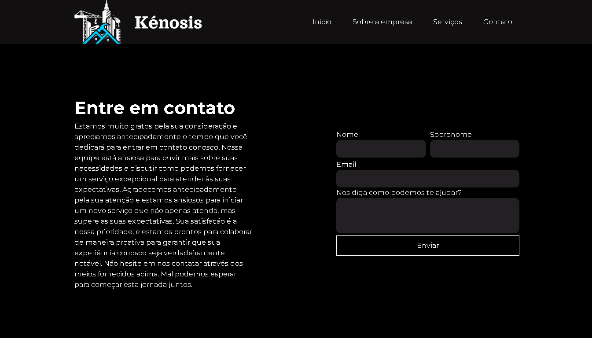

<h1>Empresa Kenosis</h1>
  
 <ul>
   <li> Status: Concluído ✅ </li>
 </ul>

<h2>Descrição do projeto</h2>
<ul>
  <li>Empresa de construção cívil, pinturas e elétrica em geral, desenvolvido para ter acesso, contato e informações sobre a empresa</li>
</ul>

  <h2>Tecnologias utilizadas</h2>
  <ul>
    <li>HTML5 </li>
    <li>CSS3  </li>
    <li>REACT </li>
  </ul>

  <h2>
    Responsividade
  </h2>

  <ul>
    <li>Desktop ✅</li>
    <li>Laptops ✅</li>
    <li>Tablets ✅</li>
    <li>Celular ✅</li>
  </ul>

  <h2>Imagens do projeto</h2>
  
  
  
